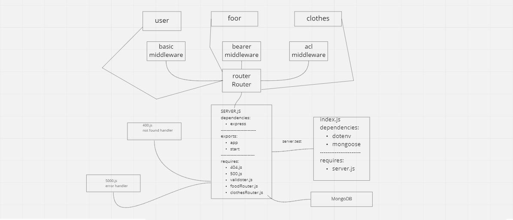

# auth-api

### Lab Description

In this final phase, the new requirement is to extend the restrictive capabilities of our routes to our API, implementing a fully functional, authenticated and authorized API Server using the latest coding techniques

Specifically, we want to make the following restrictions:

Regular users can READ Writers can READ and CREATE Editors can READ, CREATE, and UPDATE Administrators can READ, CREATE, UPDATE, and DELETE

Restrict access without a valid token AND a specific capability.

**Links Heroku Link: https://sokiyna-auth-api.herokuapp.com/**
**Github Actions: https://github.com/Sokiyna/auth-api/actions**
**Pull Request: https://github.com/Sokiyna/auth-api/pull/1**

**UML**

